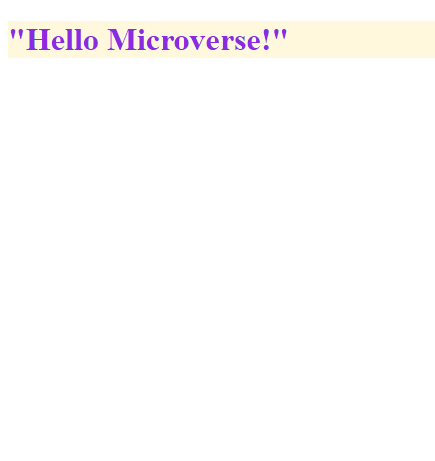

# Project Hello Microverse 

> This is my first project, a litle practice about github.

This project is a basic example of github and commands.

## Built With

- Index.html
- Style.css
- Linter

## Authors

👤 **Author1**

- GitHub: [@olivercoimbra](https://github.com/olivercoimbra)
- Twitter: [@olivercoimbra](https://twitter.com/olivercoimbra)
- LinkedIn: [olivercoimbra](https://linkedin.com/in/olivercoimbra)

## 🤝 Contributing

Contributions, issues, and feature requests are welcome!

Feel free to check the [issues page](../../issues/).

## Show your support

Give a ⭐️ if you like this project!

## Acknowledgments

- Hat tip to anyone whose code was used
- Inspiration
- etc

## 📝 License

This project is [MIT](./MIT.md) licensed.
